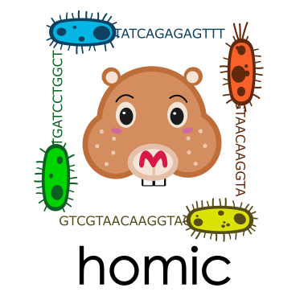

# Version 2.0.1.

A python package for HOst-MICrobiome (homic) spatial analysis 

# Installation guide

```python
import sys
sys.path.append('/path/to/the/package/folder/src')
from homic import file_readers, simulate_16S, dl_model
```
 
# Folders

* src
    - main scripts of the package
* tests
    - examples / tutorials
* models
    - precomputed DL models and encoders for the species specified in the list files/65sp.txt
* files
    - collection of small-size input files, including barcodes, reference genomes and species lis
* imgs
    - images for the package, e.g. logo

# Examples

The example scripts for running the homic function, can be found in the "tests" folder.

# Help

https://github.com/mategarb/homic/blob/main/tests/help.ipynb
